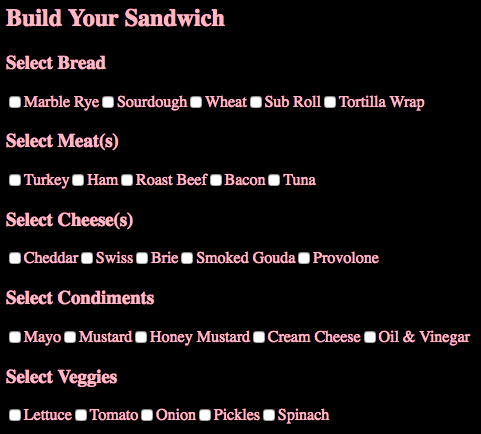
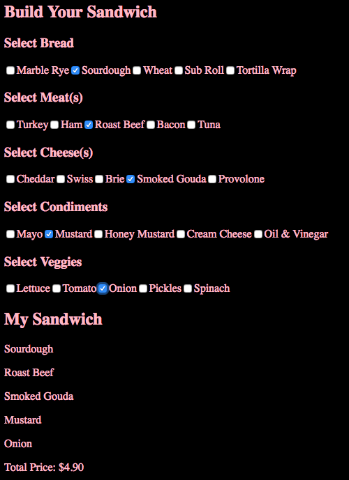

# Browserify Sandwich

> Nashville Software School, Full-Stack Dev Bootcamp, Front-End Independent Exercise
> 

### Requirements


1. Convert your Sandwich Maker code https://github.com/lady-ace/iife-sandwich to use CommonJS module pattern instead of the IIFE pattern and have a [Grunt task](https://gist.github.com/morecallan/732a2923b18c99c14ffd8d9838bf3410) for compiling your modules.
1. Use XHR to load JSON files for each type of topping/bread.
1. Implied requirements: Lint your JS (we should get no errors if we run Grunt), informative README.md




	
### How to run (Node must be installed on your machine):
```
git clone https://github.com/lady-ace/Browserify-Sandwich-Maker
cd Browserify-Sandwich-Maker
```
```
cd lib
npm init
npm install grunt grunt-contrib-jshint matchdep grunt-contrib-watch grunt-browserify jshint-stylish --save-dev
```

```
npm install http-server -g
http-server -p 8080
```

This will show in your browser at:
`http://localhost:8080`

### Contributors:
[Jessica Brawner](https://github.com/lady-ace)
